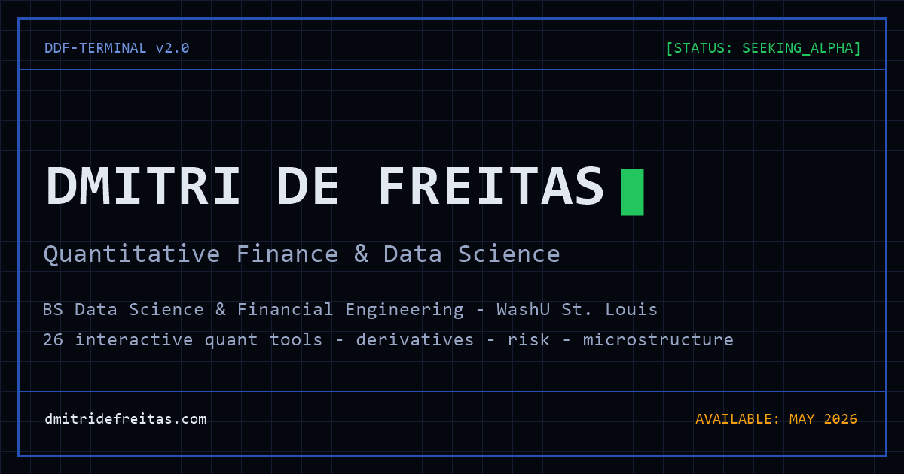

# dmitridefreitas.com — DDF·TERMINAL



Personal portfolio of **Dmitri De Freitas** — quantitative finance & data science. Built as a Bloomberg-terminal-styled SPA with **26 interactive quant tools** implemented from scratch in the browser (no third-party quant libraries).

**Live site: [dmitridefreitas.com](https://dmitridefreitas.com)**

## Highlights

- **Research Lab** (`/lab`) — IV surface with SVI calibration, options analytics with full Greeks P&L attribution, HMM regime detection (Baum-Welch/Viterbi), portfolio optimizer, VaR (historical/parametric/Monte Carlo), yield-curve fitting (Nelson-Siegel/splines), stochastic process simulator (GBM/OU/CIR/Heston), limit order book simulator, deflated Sharpe backtest statistics, DCF modeler on live fundamentals, latency benchmarks, and more
- **Live market data** — news feed with SEC EDGAR filings, tickers, macro regime HUD
- **AI assistant** — Groq-powered chatbot with site navigation, plus voice (Whisper transcription / ElevenLabs TTS)
- **Recruiter one-pager** (`/recruiter`) — resume, availability, top tools, contact on one screen

## Architecture

```
apps/web/       React 18 + Vite + Tailwind/Radix SPA (route-level code splitting)
src/            Express API — news, market data, tickers, chat, transcribe, TTS
                (deployed separately on Render from the `newsapi` repo)
out/            Production build — deployed as static files (Hostinger)
tools/          ui-audit.mjs: CDP-based audit harness (screenshots, overflow +
                console-error detection across every route and viewport)
```

- Frontend calls the API at `/hcgi/api/*` locally (proxied) and the Render service in production
- Contact form delivers via Web3Forms client-side (no backend dependency)
- Main bundle is 503 KB (163 KB gzip); heavy libraries (recharts, plotly) load per-route

## Local development

```bash
npm install --legacy-peer-deps

# build the frontend into out/
cd apps/web && node ../../node_modules/vite/bin/vite.js build --outDir ../../out --emptyOutDir

# serve the built site on :4000 (+ API proxy) and the API on :3001
node serve-local.js
node src/main.js
```

API keys (Groq, ElevenLabs, mail) are supplied via a local `.env` / host environment variables — never committed.

## Companion libraries

The core quant implementations are published as standalone, CI-tested Python packages:

- [**svi-volatility-calibration**](https://github.com/dmitridefreitas-dev/svi-volatility-calibration) — raw-SVI smile calibration (quasi-explicit inner solve, from-scratch Nelder–Mead, Gatheral–Jacquier arbitrage checks)
- [**hmm-regime-detection**](https://github.com/dmitridefreitas-dev/hmm-regime-detection) — Gaussian HMM with Baum–Welch, Viterbi, and log-space forward–backward
- [**backtest-statistics**](https://github.com/dmitridefreitas-dev/backtest-statistics) — Probabilistic + Deflated Sharpe Ratio, expected-max SR, MinTRL (Bailey & López de Prado)

## Research papers

Working papers typeset from the research behind the tools (in [`papers/`](papers/)):

- *The Deflated Sharpe Ratio in Practice* — multiple-testing-aware Sharpe inference, with a best-of-200-noise Monte Carlo demonstration
- *Short-Horizon Market Efficiency Following Positive Earnings Surprises* — the PEAD event study (11/110 stocks with significant 3-day alpha)

## Testing

```bash
node tools/ui-audit.mjs          # key pages, desktop + mobile screenshots + checks
node tools/ui-audit.mjs --all    # all 42 routes
```

---

© 2026 Dmitri De Freitas · [LinkedIn](https://www.linkedin.com/in/dmitri-de-freitas-16a540347/)
